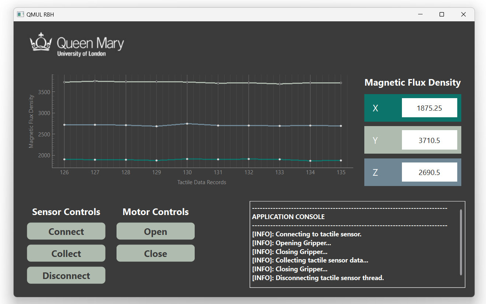

# Queen Mary University of London
## MSc Advanced Robotics
### Soft Robotic Gripper - Graphical User Interface

<picture>
    
</pictuer>

## Overview
This application was created to provide a graphical interface for the [soft robotic gripper](https://github.com/gpoell/qmul-rbh-esp32) to wirelessly operate the gripper, visuale real time tactile sensor data to understand grip forces, and record the tactile data for machine-learning processes. The GUI is developed with [PyQt](https://doc.qt.io/qtforpython-6/) to simplify the composition of graphical components that make up the application while also preserving familiarity with the Python programming language for future students who are interested in enhancing this tool for their research projects. In the spirit of continuity, this README provides a thorough outline of the entire application, including detailed instructions on how to clone and run the application, an overview of how components communicate with the robotic gripper and each other, information on how the repository and PyQt components are organized, and a list of additional resources to expand upon topics covered below.

## Table of Contents
1. [Project Background](https://github.com/gpoell/qmul-rbh-gui/tree/feature-update-readme?tab=readme-ov-file#installation-and-dependencies)
2. [Installation and Dependencies](https://github.com/gpoell/qmul-rbh-gui/tree/feature-update-readme?tab=readme-ov-file#installation-and-dependencies)
3. [Running the Application](https://github.com/gpoell/qmul-rbh-gui/tree/feature-update-readme?tab=readme-ov-file#running-the-application)
4. [Application Architecture](https://github.com/gpoell/qmul-rbh-gui/tree/feature-update-readme?tab=readme-ov-file#application-architecture)
5. [PyQt Components](https://github.com/gpoell/qmul-rbh-gui/tree/feature-update-readme?tab=readme-ov-file#pyqt-components)
6. [Repository Folder Structure](https://github.com/gpoell/qmul-rbh-gui/tree/feature-update-readme?tab=readme-ov-file#repository-folder-structure)
7. [Helpful Articles](https://github.com/gpoell/qmul-rbh-gui/tree/feature-update-readme?tab=readme-ov-file#helpful-articles)

## Project Background
My dissertation is focused on classifying strawberry ripeness using the tactile data from the soft robotic gripper. The goal is to develop a technique that emulates how we use our sense of touch to assess the quality of certain crops, like picking ripe avacados at a supermarket. Computer vision is a popular and efficient technique for assessing crop ripeness, especially now that modern cameras can see better than humans. However, not all crops show obvious signs of differentiable ripeness levels, and problems with computer vision still persist in occluded harvesting environments where cameras struggle to see through shadows or branches, which is still an issue while harvesting strawberries. Providing a simple technique using tactile data to reinforce what the camera sees with what the gripper feels could prove useful when harvesting in occluded environments and performing post harvest quality inspections.

## Installation and Dependencies
### Software
Python3 is required to run this application and the latest download insturctions are found [here.](https://www.python.org/downloads/ "Python Downloads"). The current version used at the time of writing this documentation is 3.11.2.
Software     | Version
------      | ------
Python3        | latest

### Python Libraries
The following libraries are required to run the application and can be installed from the repository's [requirements.txt](requirements.txt). See the next section, Running the Application, for more details. 
Library     | Version
------      | ------
PyQt        | PyQt6
pyyaml      | latest
matplotlib  | latest

## Running the Application
Below are prerequisite instructions to clone the repository using SSH and running the application. [Python virtual environments](https://docs.python.org/3/library/venv.html) are highly recommended for managing dependency version conflicts with other applications.

<details>
<summary>Cloning the repository with SSH</summary>

1. Install the latest version of [Python](https://www.python.org/downloads/ "Python Downloads")
2. Connect to your GitHub account with SSH: [Connecting to GitHub with SSH](https://docs.github.com/en/authentication/connecting-to-github-with-ssh "Connecting to GitHub with SSH"). Specifically use the instructions below
    1. <https://docs.github.com/en/authentication/connecting-to-github-with-ssh/generating-a-new-ssh-key-and-adding-it-to-the-ssh-agent>
    2. <https://docs.github.com/en/authentication/connecting-to-github-with-ssh/adding-a-new-ssh-key-to-your-github-account>
3. Clone the repository:
```
git clone git@github.com:gpoell/qmul-rbh-gui.git
```
</details>

<details>
<summary>Running the application</summary>

1. Create a [python virtual environment](https://docs.python.org/3/library/venv.html) at the root directory level of the repository
```
cd qmul-rbh-gui
python -m venv .
```
2. Activate the virtual environment and install dependencies
```
. Scripts/activate
pip install -r requirements.txt
```
3. Run the Application
```
python src/app.py
```
Note: the connection details to the ESP32 server are automatically read from a local configuration file called local_conf.yaml at the root level of your repository. The configuration file should have your connection details in the following [yaml](https://pypi.org/project/PyYAML/) format.  
<b>local_conf.yaml</b>
```
client:
    host: "127.0.0.1"
    port: 5000
```
</details>


## Application Architecture
The GUI is a multithreaded application that communicates with the ESP32 server over Wi-Fi. Commands sent to the server occur during events like pressing buttons. The buttons emit commands as [PyQt signals]() which are received by the State Machine's [PyQt Slots](). The State Machine is a centralized component responsible for monitoring the state of application to ensure events are triggered at the appropriate time (e.g. the gripper cannot open and close at the same time.) and executing commands through seperate [threads]() which is vital for simultaneously reading tactile data and operating the gripper. Each thread maintains a connection with the server using [Python Sockets]() that follows the communication protocol outlined below. Incoming data received from the server is emitted to various GUI components to provide data for visualizations and information for the terminal.

<picture>
    
</pictuer>

<details>
<summary>PyQt Signals and Slots</summary>

[PyQt Signals and Slots]() are the primary mechanisms for how the various components communicate with each other. Components can emit signals of a specific type to be received by other components with slots that are actively listening for those signals. The functionality of pressing the connect button to read tactile data from the gripper and displaying its information on the console is a perfect example of how to use signals and slots.

When the Connect button (line 18, 19) is clicked, it executes the emit_signal() function (line 33) which broadcasts a signal with the command and signal name (line 6).

<b>SensorControls.py</b>

```
6.     sig_state_command = Signal(str, name="stateCommand")  
18.    self.connect_btn = QPushButton("Connect")  
19.    self.connect_btn.clicked.connect(lambda: self.emit_signal("connect"))  
33.    self.sig_state_command.emit(command)
```

The State Machine has a slot decorator (line 41) that actively listens for string signals with the name "stateCommand" and uses the value to determine which processes to run in seperate threads (line 42, 58). In this scenario, the "connect" signal executes the Tactile Sensor connect method (line 60).

<b>StateMachine.py</b>
```
41.     @Slot(str, name="stateCommand")  
42.     def exec(self, command):  
58.     case "connect":  
60.     worker = ThreadWorker(self.tactile_sensor.connect)
```

The Tactile Sensor connect method reads data from the tactile sensor and emits it under a new signal (line 22; 54) that is received by the Console under its Slot decorator. The Console function wrapped by the Slot decorator executes when it receives signals with a tuple type and "tactileData" name which updates the information displayed on the console (line 19, 20).

<b>TactileSensor.py</b>
```
22.     sig_tactile_data = Signal(tuple, name='tactileData')  
54.     self.sig_tactile_data.emit((batch[0], batch[1], batch[2]))
```

<b>Console.py</b>
```
19.     @Slot(tuple, name="tactileData")  
20.     def tactile_data_format(self, data):
```
</details>

<details>
<summary>PyQt Threads</summary>

[Threads](https://docs.python.org/3/library/threading.html) are used to continuously read tactile data, open and close the gripper, and run additional processes (almost) simultaneously. Without threading, clicking the Connect button would block the user from trying to open and close the gripper. Threading is a big topic that is thoroughly explained in other articles (see Helpful Articles), so for the sake of brevity, an overview of how threads are leveraged in this application is outlined below.

Every command sent to the ESP32 server is communicated through a unique thread. PyQt provides several components that simplify generating new threads ([QThreads](https://doc.qt.io/qtforpython-5/PySide2/QtCore/QThread.html)) and managing the lifecycle of multiple threads ([QThreadPool](https://doc.qt.io/qtforpython-5/PySide2/QtCore/QThreadPool.html)). As mentioned in the previous section, the State Machine facilitates the execution of server commands through threaded processes and managing the thread pool. Threaded processes are constructed by linking functions or object methods to the Thread Worker (see Threadworker.py) and started by adding them to the thread pool (see StateMachine.py below).

<b>StateMachine.py</b>
```
74.    self.threadpool.start(worker)
```

</details>

<details>
<summary>Python Socket Protocol</summary>

[Python Sockets](https://docs.python.org/3/library/socket.html#) are used as the primary network interface for communicating with the Esp32 server. The Helpful Articles section contains additional resources that explain how these work in more detail, so the rest of this section explains how sockets are implemented within this application to communicate with the ESP32 server.

Every command sent to the server is managed by a unique thread that contains a unique connection which is responsible for sending and receiving data specific to that command. The EspClient component (EspClient.py) handles a majority of the functionality for connecting to the server, sending data, receiving data, and closing the connection. These methods are utilized by Tactile Sensor (TactileSensor.py) and Motor (L9110HMotor.py) components to perform their respective functions (e.g. reading tactile data or moving the gripper) with their respective clients.

The process for communicating with the server through sockets is generally the same:
1. Connect to the server
2. Send command
3. Receive data from the server
4. Close the connection

Most of the variation in the steps outlined above occurs while receiving data from the server, specifically with reading messages from the server buffer. It is required to specify the size of the buffer to read, and the size of every message varies which can cause information to overflow and spawn downstream issues. To simplify the protocol, a fixed message size of ### bytes (in progress) is always sent from the server and read until a null terminating character is received. Ideally we would want to determine the length of each message prior to reading it, possibly through prefixing messages with headers, to minimize the waste. For now, the prefixed size is small enough to avoid noticeable performance issues.

</details>


## PyQt Components
<details>
<summary>Creating Components and Layout Management</summary>

PyQt provides a variety graphical components, such as buttons and text boxes, called QWidgets. Widgets are combined to create the Components and Containers that make up the entire application, and the order in which they are displayed is handled through [PyQt Layout Management](https://doc.qt.io/qtforpython-5/overviews/layout.html). Components must inherit from the QWidget class to properly render in the GUI.  

To conceptualize how the interface is built, everything is managed in boxes that may contain other boxes. The GUI itself is a large box with other smaller boxes aligned vertically and horizontally using layout management. For example, the Control Panel consists of two boxes of buttons that that are horizontally aligned. These buttons are grouped based on their Sensor (SensorControls.py) and Motor (MotorControls.py) functionality and are vertically aligned. For new contributors to this project, I encourage you to change the layout of the buttons to horizontal and flip how they are ordered in the Control Panel to get a feel for how the layouts work.

Building further on this nested box concept is the hierarchy of how components are grouped. The largest grouping of components are considered containers. The Desktop is the largest container consisting of smaller containers (e.g. Console.py and ControlPanel.py) which consist of Components that consist of Widgets. This hierarchy is intended to help organize and modularize the code and improve maintainability.

Lastly, the creation of every container and component follows the same standard process:

<b>Example: MotorControls.py</b>
1. Create the main layout and any sublayouts
2. Create the widgets or components
3. Add the widgets to the layouts

</details>
 
## Repository Folder Structure
Below is a summary of how the code for the GUI is organized. It leverages a container, components, and utils architecture to modularize the major sections of the application, reusable components, and shared utility functions.

📁src/ -- all source code for the application
* 📁components/ -- reusable components shared throughout the application
* 📁containers/ -- containers and components that make up the application
* 📁utils/      -- reusable scripts shared throughout the application
* app.py
* styles.css

## Helpful Articles

<b>Layout Management</b>  
[Layout Management](https://doc.qt.io/qtforpython-5/overviews/layout.html)  
[Basic Layouts Example](https://doc.qt.io/qtforpython-5/overviews/qtwidgets-layouts-basiclayouts-example.html)

<b>Sockets</b>  
[Python Sockets](https://docs.python.org/3/library/socket.html#)  
[Python Sockets How To](https://docs.python.org/3/howto/sockets.html)

<b>Threading</b>  
[Implementing Multi-threaded Network Servers in Python (w3computing.com)](https://www.w3computing.com/articles/implementing-multi-threaded-network-servers-python/)  
[An Intro to Threading in Python – Real Python](https://realpython.com/intro-to-python-threading/)  
[Multithreading PyQt5 applications with QThreadPool](https://www.pythonguis.com/tutorials/multithreading-pyqt-applications-qthreadpool/)  
[PyQt Concurrency](https://doc.qt.io/qtforpython-6/overviews/qtconcurrentrun.html)  
[PyQt QThread](https://www.pythontutorial.net/pyqt/pyqt-qthread/)